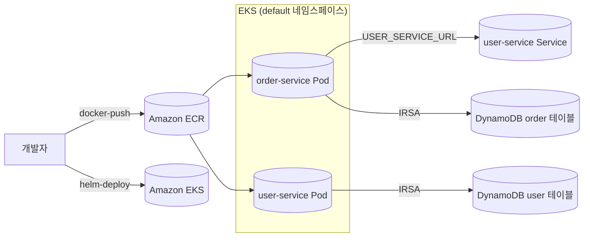

# 서비스 아키텍처 개요

```mermaid
flowchart LR
    dev[개발자] -->|docker-push| ecr[(Amazon ECR)]
    dev -->|helm-deploy| eks[(Amazon EKS)]

    subgraph EKS["EKS (default 네임스페이스)"]
        orderPod[(order-service Pod)]
        userPod[(user-service Pod)]
    end

    orderPod -->|USER_SERVICE_URL| userSvc[(user-service Service)]
    orderPod -->|IRSA| dynamoOrder[(DynamoDB order 테이블)]
    userPod -->|IRSA| dynamoUser[(DynamoDB user 테이블)]

    ecr --> orderPod
    ecr --> userPod
```

